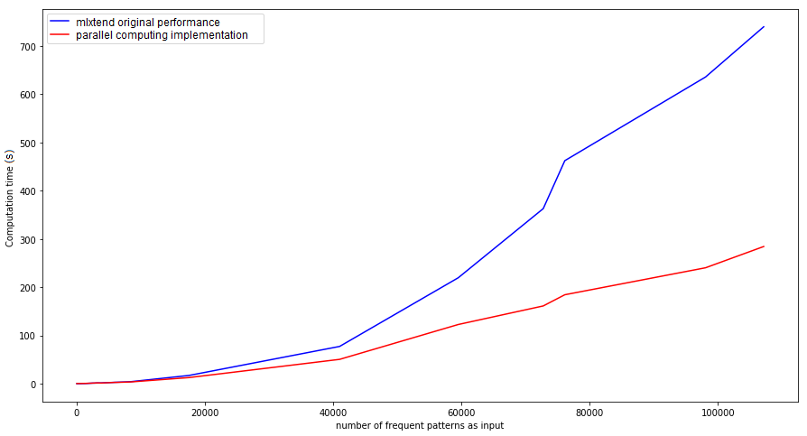

# Parallel_association_rules
Parallel computing implementation of association rules learning.
Along with the usage of the multiprocessing module, the source code for association-rule learning is modified such that it takes a subset of the frequent patterns beside the complete set, but only calculates the rules for the supset with regard to the complete set of the frequent patterns. The results are verified in being exactly the same as the original implementation but as shown in the below figure is faster and scalable.

external dependencies:
 * [Numpy](http://www.numpy.org/)
 * [pandas](https://pandas.pydata.org/)
 
For calculating frequent pattenrs an optional method is:

 * [mlxtend](http://rasbt.github.io/mlxtend/user_guide/frequent_patterns/association_rules/#association-rules-generation-from-frequent-itemsets) (with "apriori" module. Another alternative is pyspark mllib for frequent pattern tree)


# example:
```
frequent_petterns = mlxtend.frequent_patterns.apriori(
                                                     transactions_DataFrame,
                                                     min_support=0.5,
                                                     max_len=4
                                                     )
                                                     
#  similar to mlxtend.frequent_patterns.association_rules but for computation in parallel:                                                    
association_rules_results = parallel_association_rules (
                                                        frequent_petterns,
                                                        n_parallel_branch=multiprocessing.cpu_count(),
                                                        metric="confidence",
                                                        min_threshold=0.7
                                                        )
```


# Comparison

